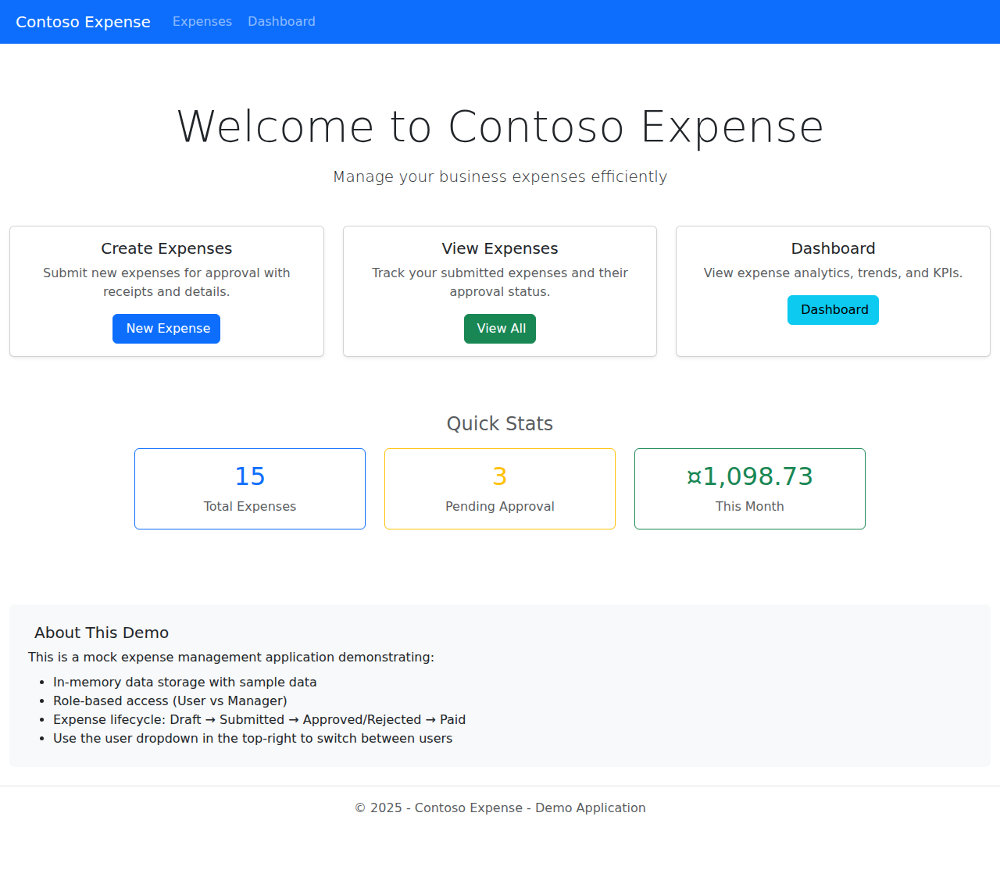
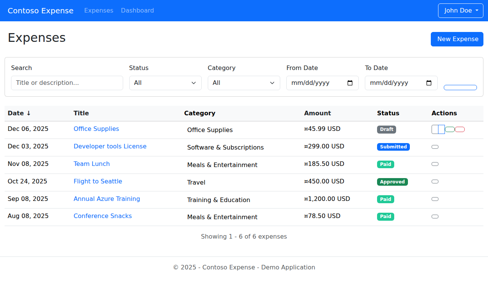
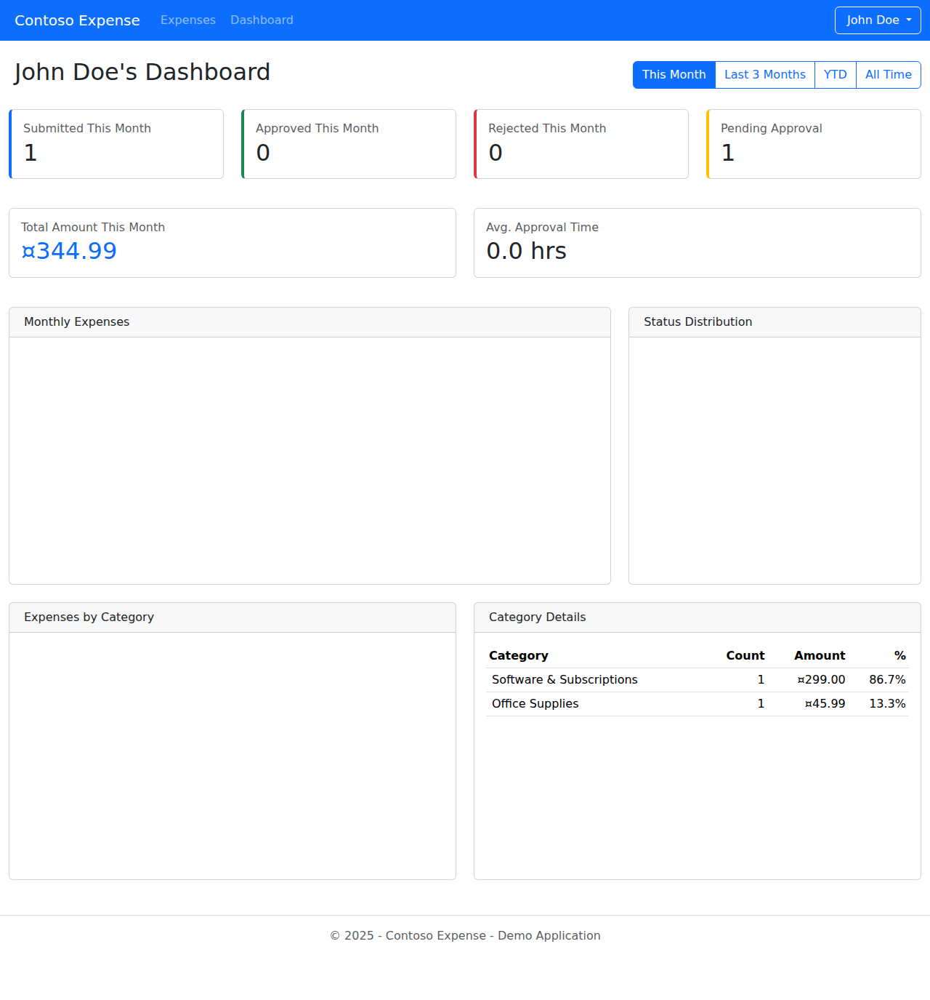

# Contoso Expense

This repository contains a mockup demo of the **Contoso Expense App**, a sample line-of-business application for managing and analyzing expenses. It is intended for demos, learning, and experimentation rather than production use.

## Overview

Contoso Expense showcases a typical enterprise-style expense management workflow:

- Tracking users and expense categories
- Creating and managing expenses
- Calculating summaries and dashboards
- Applying configurable system settings

The solution is organized as:

- **ContosoExpense** – main application project
- **ContosoExpense.Tests** – automated test project for core services and repositories

## Screenshots

### Home Page
The main landing page provides quick access to key features and displays expense statistics.



### Expenses List
View and manage all expenses with filtering and sorting capabilities.



### Dashboard
Comprehensive analytics and insights into expense patterns and trends.



## Key Features

- **Expense Management**
  - Create and manage expenses
  - Associate expenses with categories and users
  - Repository layer for expenses and related entities

- **Dashboard & Analytics**
  - Dashboard service aggregating expense data
  - High-level views over spending patterns

- **Configuration & System Settings**
  - System settings service for configurable behavior
  - Centralized handling of application-level configuration

- **Test Coverage**
  - Unit tests for:
    - `CategoryRepository`
    - `UserRepository`
    - `ExpenseRepository`
    - `ExpenseService`
    - `DashboardService`
    - `DataManagementService`
    - `SystemSettingsService`

## Technologies

- **C# (.NET)** – application logic, domain models, repositories, and services
- **HTML** – UI layout and markup
- **Other assets/configuration** – support files and configuration

## Project Structure

At a high level:

- `ContosoExpense/`
  - Main application source (C# + HTML)
  - Program startup, configuration, and web host
  - Controllers/pages (depending on the chosen web stack)
  - Domain models, services, and repositories

- `ContosoExpense.Tests/`
  - `ContosoExpense.Tests.csproj` – test project definition
  - `CategoryRepositoryTests.cs`
  - `UserRepositoryTests.cs`
  - `ExpenseRepositoryTests.cs`
  - `ExpenseServiceTests.cs`
  - `DashboardServiceTests.cs`
  - `DataManagementServiceTests.cs`
  - `SystemSettingsServiceTests.cs`

- `.github/`
  - GitHub-specific configuration (workflows, templates, etc.)

- `.gitignore`
- `LICENSE`

## Getting Started

> This project is a demo. The exact .NET version and hosting details may depend on the current project configuration. Adjust commands below to your local environment if necessary.

### Prerequisites

- [.NET SDK](https://dotnet.microsoft.com/download) installed
- Git
- A modern web browser

### Clone the Repository

```bash
git clone https://github.com/frkim/contosoexpense.git
cd contosoexpense
```

### Build the Solution

From the repository root:

```bash
dotnet build
```

### Run the Application

From the main application project directory (for example):

```bash
cd ContosoExpense
dotnet run
```

Then open the URL printed in the console (commonly `https://localhost:xxxx` or `http://localhost:xxxx`) in your browser.

### Run Tests

From the repository root:

```bash
dotnet test
```

This will execute all tests under `ContosoExpense.Tests`.

## Intended Use

- Demoing expense-management concepts and architecture
- Learning and experimenting with:
  - Repository and service layers
  - Unit testing in .NET
  - Basic dashboard and reporting logic
- Serving as a sandbox for prototyping new ideas

This app is **not** hardened for production; it may use in-memory data, simplified security, and demo-friendly shortcuts.

## License

This project is distributed under the terms of the license found in [`LICENSE`](LICENSE). Review it before using this code in your own projects.

## Contributing

Because this is primarily a demo app, contributions are optional and informal. If you do contribute:

1. Fork the repository
2. Create a feature branch
3. Add tests where appropriate
4. Open a pull request with a clear description of your changes

---

_Contoso Expense is a sample application for educational and demonstration purposes only._
